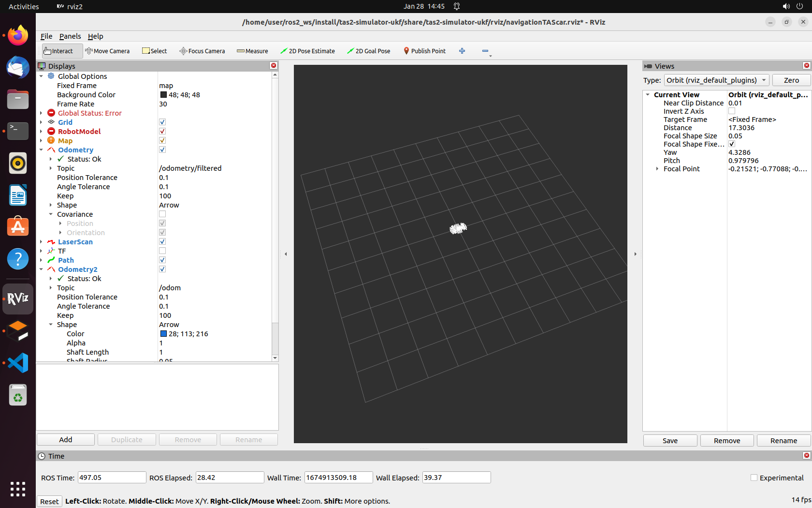
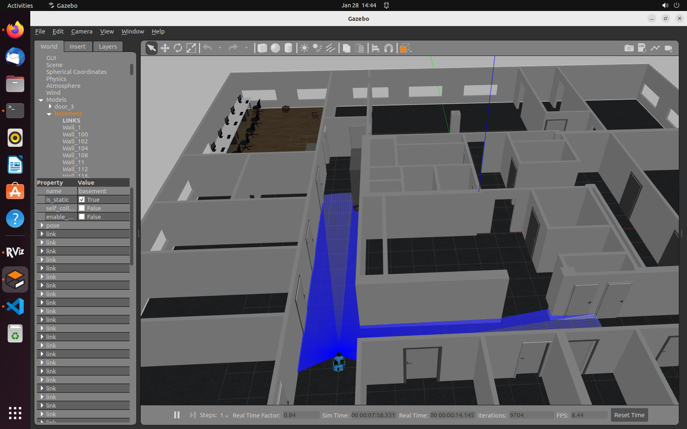
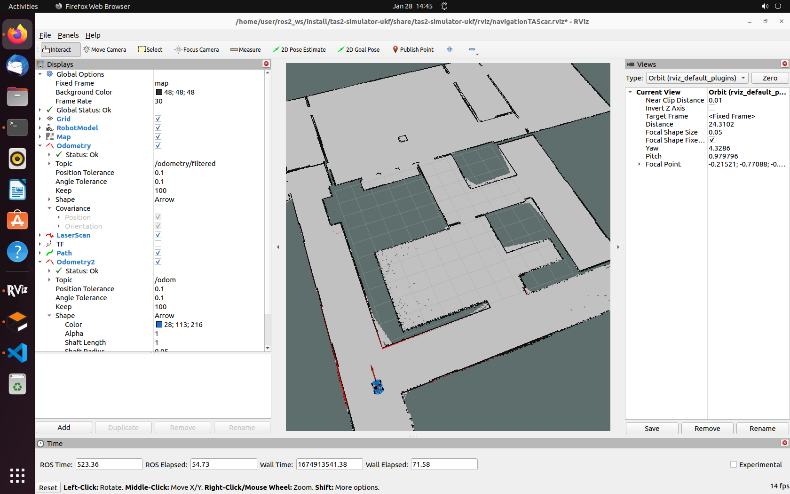

# tas-simulator


## Getting started

The tas-simulator is based on ROS2 and Ubuntu 22.04. This project contains three packages: [tas2-simulator-ekf](https://gitlab.lrz.de/tas_2223/tas-project/group_10/tas-simulator/-/tree/main/tas2-simulator-ekf), [tas2-simulator-ukf](https://gitlab.lrz.de/tas_2223/tas-project/group_10/tas-simulator/-/tree/main/tas2-simulator-ukf) and [evaluate](https://gitlab.lrz.de/tas_2223/tas-project/group_10/tas-simulator/-/tree/main/evaluate). The individual tasks of each package are described in the respective readme.md.

This project can display the car in rviz and gazebo, autonomous navigation in the map, and also the evaluation of the performance of different filters (ekf and ukf) in the task.

## Demo video
Demo video of this project: [YouTube](https://www.youtube.com/watch?v=nG2ss1-ITGU)

## Installation Guide
The tas-simulator is based on ROS2 and Ubuntu 22.04. 

Following are the steps to install the tas-simulator.

- Install ROS2. Check the guidelines [here](https://docs.ros.org/en/humble/index.html) for installation. 
  
- Create the workspace and src directories. [Further Information Here](https://docs.ros.org/en/humble/Tutorials/Beginner-Client-Libraries/Colcon-Tutorial.html)
  
  ```
  mkdir -p ~/ros2_ws/src
  ```

- Clone this repository to the 'src' directory, Make sure all the three packages are in src.
  
  ```
  cd ~/ros2_ws/src
  git clone ""link to the repository here""
  ```

- Before building, make sure you have installed some relevant packages. The packages that need to be installed are the same as the [TAS2-simulator](https://gitlab.lrz.de/tas_2223/tas2-simulator).
  
-  Now build the workspace.
  
    ```
    cd ~/ros2_ws
    colcon build --symlink-install
    ```

- The workspace should have the source code of the tas-simulator. Your workspace directory should look like this; Make sure all packages are in src.
  
  ```
  ros2_ws
  │   build
  │   install    
  │   log
  └───src
      │   evaluate
      │   tas-simulator-ekf
      └───tas-simulator-ukf
          │   config
          │   launch
          |   maps
          |   models
          |   rviz
          |   CMakeLists.txt
          │   package.xml
  ```

- Remember to source your workspace

  ```
    echo "source /usr/share/colcon_cd/function/colcon_cd.sh" >> ~/.bashrc
    echo "export _colcon_cd_root=/opt/ros/humble/" >> ~/.bashrc
  ```

## Demo - Autonomous Navigation localization algorithm: UKF
-  In order to try this demo, run the following command first. 


  ```
  ros2 launch tas2-simulator-ukf gazeboBringupTAScar_ukf.py
  ```
  Rviz as shown:

 

 Gazebo as shown:

  


- When the TAS car has spawned in Gazebo, then run the following command in separate terminal.
  
  ```
  ros2 launch tas2-simulator-ukf navigationTAScar_ukf.py
  ```

  Rviz as shown:

   

   You will now see the rviz starting up and loading of Nav2 related nodes. 
Confirm that you see the map in the rviz otherwise you have to restart.

- Next, publish the goal_pose to the car and you will see the car moving to that goal pose. (You can modify the goal in the [pub_goal.py](https://gitlab.lrz.de/tas_2223/tas-project/group_10/tas-simulator/-/blob/main/evaluate/evaluate/pub_goal.py) or [pub_goal2.py](https://gitlab.lrz.de/tas_2223/tas-project/group_10/tas-simulator/-/blob/main/evaluate/evaluate/pub_goal2.py).)  
  
  ```
  ros2 run evaluate goal2 
  ```

Car is moving:

  


## Demo - Autonomous Navigation localization algorithm: EKF
In the localization algorithm for autonomous navigation, the whole process is the same as in the demo above (Demo - Autonomous Navigation localization algorithm: UKF), just replacing the ukf algorithm with ekf.

Run the following commands:
  ```
  ros2 launch tas2-simulator-ekf gazeboBringupTAScar_ekf.py
  ros2 launch tas2-simulator-ekf navigationTAScar_ekf.py
  ros2 run evaluate goal2 
  ```
Attention: The process is strictly following the first demo ! (Demo - Autonomous Navigation localization algorithm: UKF)


## Demo - Evaluation the localization algorithm: EKF / UKF 
In this step, compare the odometry information before and after the filter, the position error and orientation error are calculated.
Run the following commands:

- First, show the car and map in gazebo and rviz. (If you want to use ekf, just replace ukf with ekf in the code)
Attention: The process is strictly following the first demo ! (Demo - Autonomous Navigation localization algorithm: UKF)
  ```
  ros2 launch tas2-simulator-ukf gazeboBringupTAScar_ukf.py
  ros2 launch tas2-simulator-ukf navigationTAScar_ukf.py      # change ukf to ekf if you want
  ```
- Then, run the evaluation code.
  
  ```
  ros2 run evaluate eval
  ```
- Finally, publish the goal pose information.
  ```
  ros2 run evaluate goal2 
  ```
You will see the car moving to the goal pose and the evaluation of the position error as well as the orientation error, and the visualization of the results.

The results of the evaluation and the visualization of the error curves:

  

## Demo - Comparison of two algorithms
In this demo, it compares the different filters. 
Run the following commands:
- First, show the car and map in gazebo and rviz. 
Attention: The process is strictly following the first demo ! (Demo - Autonomous Navigation localization algorithm: UKF)

  ```
  ros2 launch tas2-simulator-ukf gazeboBringupTAScar_ukf.py
  ros2 launch tas2-simulator-ukf navigationTAScar_ukf.py
  ```

- Then, run the overall evaluation code and publish the goal pose information.

  ```
  ros2 run evaluate evalall
  ros2 run evaluate goal2 
  ```
- Finally, you will see the position error and orientation error of the two different filters:
  
  


## Possible Issues and their solution
 - The evalute/evaluate/data folder stores data that can be used for overall evaluation (Demo - Comparison of two algorithms). If you need your own data, modify the paths within the [save_data.py](https://gitlab.lrz.de/tas_2223/tas-project/group_10/tas-simulator/-/blob/main/evaluate/evaluate/save_data.py) and the [eval_all.py](https://gitlab.lrz.de/tas_2223/tas-project/group_10/tas-simulator/-/blob/main/evaluate/evaluate/eval_all.py), and run the following commands:
  
    ```
    ros2 launch tas2-simulator-ukf gazeboBringupTAScar_ukf.py
    ros2 launch tas2-simulator-ukf navigationTAScar_ukf.py
    ros2 run evaluate savedata
    ros2 run evaluate goal2 
    ```

 - If you want to change the goal_pose of the car, please change the [pub_goal.py](https://gitlab.lrz.de/tas_2223/tas-project/group_10/tas-simulator/-/blob/main/evaluate/evaluate/pub_goal.py) or [pub_goal2.py](https://gitlab.lrz.de/tas_2223/tas-project/group_10/tas-simulator/-/blob/main/evaluate/evaluate/pub_goal2.py). Note: Sometimes publish the goal_pose in pub_goal.py (node: goal) may lead some issues, change it to run pub_goal2.py (node: goal2).

 - Other issues, described in detail in [TAS2-simulator](https://gitlab.lrz.de/tas_2223/tas2-simulator). You can check them in this link.
  
## Acknowledgement
This project is not possible without multiple great opensourced codebases.
- [ ] [TAS2-simulator](https://gitlab.lrz.de/tas_2223/tas2-simulator).
- [ ] [Ros2 Humble](https://docs.ros.org/en/humble/index.html).
- [ ] [robot_localization]( https://github.com/cra-ros-pkg/robot_localization).
- [ ] [Navigation 2](https://navigation.ros.org/).
